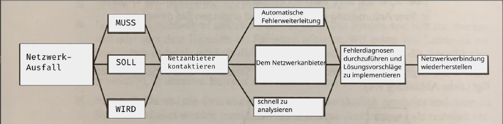
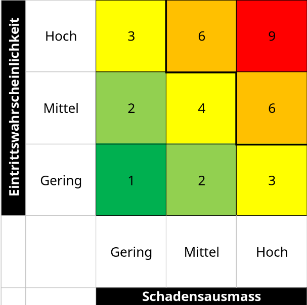
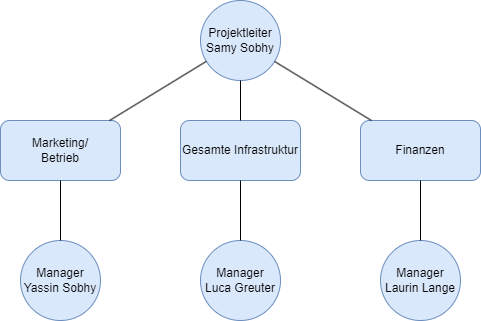
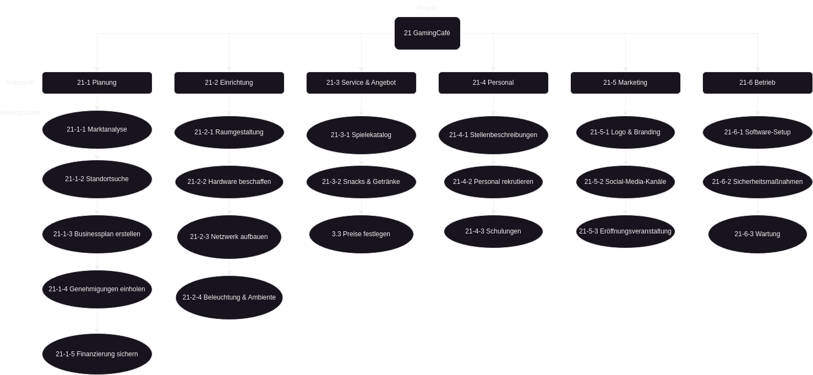
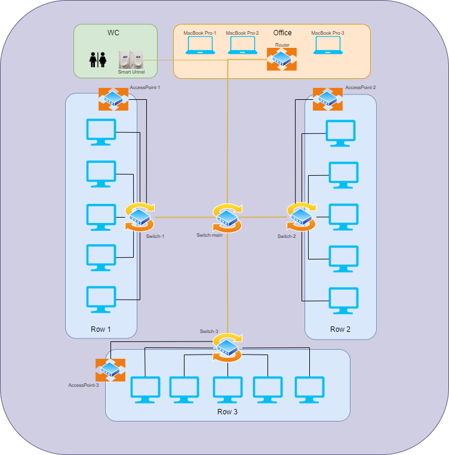

<h1 style="text-align:center;">Gaming Café</h1>

12.11.24 Yassin Sobhy, Laurin Lange, Luca Greuter

<h2>Inhalt</h2>

<!-- TOC -->

- [Projektidee: Aufbau eines modernen Gaming-Cafés](#projektidee-aufbau-eines-modernen-gaming-cafés)
  - [Beschreibung](#beschreibung)
- [Projektziele](#projektziele)
  - [1. Internetverbindung sicherstellen](#1-internetverbindung-sicherstellen)
  - [2. Netzwerkplanung abschließen](#2-netzwerkplanung-abschließen)
  - [3. Hardware beschaffen](#3-hardware-beschaffen)
  - [4. Netzwerk einrichten](#4-netzwerk-einrichten)
  - [5. PCs vorbereiten](#5-pcs-vorbereiten)
  - [6. Server einrichten](#6-server-einrichten)
  - [7. Systemtest durchführen](#7-systemtest-durchführen)
  - [8. Technischen Supportplan erstellen](#8-technischen-supportplan-erstellen)
- [Projektanforderungen: Netzwerk-Ausfall](#projektanforderungen-netzwerk-ausfall)
  - [Wann?](#wann)
  - [Unter welcher Bedingung?](#unter-welcher-bedingung)
  - [Was muss das System tun?](#was-muss-das-system-tun)
  - [Beispiel:](#beispiel)
- [Machbarkeitsanalyse](#machbarkeitsanalyse)
  - [Ist-Situation](#ist-situation)
  - [Voraussetzungen](#voraussetzungen)
  - [Risiken](#risiken)
  - [Bewertung](#bewertung)
- [Wirtschaftliche Machbarkeit](#wirtschaftliche-machbarkeit)
  - [Kostenaufstellung](#kostenaufstellung)
  - [Gesamtkosten](#gesamtkosten)
- [Risiken](#risiken-1)
  - [Cyberangriffe und Datensicherheit](#cyberangriffe-und-datensicherheit)
  - [Hardware-Ausfälle](#hardware-ausfälle)
  - [Physische Schäden](#physische-schäden)
  - [Stromunterbruch](#stromunterbruch)
- [Projektauftrag](#projektauftrag)
- [Inhalt eines Projektauftrags](#inhalt-eines-projektauftrags)
  - [Ziele](#ziele)
  - [Projektbeschreibung](#projektbeschreibung)
  - [Rahmenbedingungen](#rahmenbedingungen)
  - [Verantwortlichkeiten](#verantwortlichkeiten)
  - [Risikobewertung](#risikobewertung)
  - [Abnahme](#abnahme)
- [Organigramm](#organigramm)
- [PSP](#psp)
  - [Arbeitspakete definieren](#arbeitspakete-definieren)
- [Netzwerk Diagramm](#netzwerk-diagramm)
- [Gantt](#gantt)
- [Ressourcenplan](#ressourcenplan)
- [Kommunikationsplan für das Gaming-Café-Projekt](#kommunikationsplan-für-das-gaming-café-projekt)
  - [Ziele der Kommunikation](#ziele-der-kommunikation)
  - [Zielgruppe](#zielgruppe)
  - [Kommunikationsinhalte](#kommunikationsinhalte)
  - [Kommunikationsmethoden](#kommunikationsmethoden)
  - [Häufigkeit](#häufigkeit)
  - [Verantwortlichkeiten](#verantwortlichkeiten-1)
  - [Feedback-Prozesse](#feedback-prozesse)
- [Testplan für das Gaming-Café](#testplan-für-das-gaming-café)
  - [Ziele des Testplans](#ziele-des-testplans)
  - [Teststrategie](#teststrategie)
- [Testbereiche](#testbereiche)
  - [1. Netzwerk](#1-netzwerk)
  - [2. PCs](#2-pcs)
  - [4. Räumlichkeiten](#4-räumlichkeiten)
  - [5. Technischer Support](#5-technischer-support)
- [Testzeitplan](#testzeitplan)
- [Testberichte](#testberichte)

## Projektidee: Aufbau eines modernen Gaming-Cafés

### Beschreibung

Ein Gaming-Café, das professionelle Hardware, zuverlässige Netzwerktechnik und komfortable Räume bietet, soll entwickelt werden. Ziel ist es, eine Plattform für Gamer aller Altersgruppen zu schaffen, um E-Sport-Turniere, gemeinsames Spielen und ein gemütliches Gaming-Erlebnis anzubieten. Das Konzept umfasst eine Verbindung aus modernem Design, hochwertiger technischer Ausstattung und einem starken Fokus auf Community-Building.

## Projektziele

### 1. Internetverbindung sicherstellen
- **Spezifisch:** Vertrag für schnelles und stabiles Internet (mind. 1 Gbit/s) abschließen.
- **Messbar:** Internetgeschwindigkeit testen und Dokumentation des Tests.
- **Attraktiv:** Wesentlich für reibungslose Nutzung durch die Kunden.
- **Realistisch:** Anbieter und Angebote wurden bereits recherchiert.
- **Terminiert:** Bis spätestens 1 Monat vor der Eröffnung abgeschlossen.

### 2. Netzwerkplanung abschließen
- **Spezifisch:** Plan für Netzwerkstruktur mit Geräten (Router, Switches, Access Points) erstellen.
- **Messbar:** Dokumentierter Netzwerkplan vorhanden.
- **Attraktiv:** Erhöht Zuverlässigkeit und Effizienz der Infrastruktur.
- **Realistisch:** Know-how und Ressourcen vorhanden.
- **Terminiert:** Fertigstellung bis 3 Monate vor der Eröffnung.

### 3. Hardware beschaffen
- **Spezifisch:** Beschaffung aller Netzwerkkomponenten, einschließlich Router, Switches und Access Points.
- **Messbar:** Liste der erhaltenen Hardware und Lieferbestätigungen.
- **Attraktiv:** Notwendig für Einrichtung und Betrieb.
- **Realistisch:** Lieferanten stehen zur Verfügung.
- **Terminiert:** Abschluss 2 Monate vor der Eröffnung.

### 4. Netzwerk einrichten
- **Spezifisch:** Installation von Router und Switches, Durchführung von Kabelmanagement, Konfiguration von Netzwerken.
- **Messbar:** Abnahmeprotokoll nach erfolgreicher Einrichtung.
- **Attraktiv:** Essentiell für den Betrieb des Cafés.
- **Realistisch:** Technische Expertise vorhanden.
- **Terminiert:** Fertigstellung bis 1 Monat vor der Eröffnung.

### 5. PCs vorbereiten
- **Spezifisch:** Installation von Betriebssystem, Sicherheitssoftware und Programmen auf 15 PCs.
- **Messbar:** Funktionsprüfung und Checkliste.
- **Attraktiv:** Zentrale Nutzung durch Kunden.
- **Realistisch:** Zeitrahmen und Ressourcen ausreichend.
- **Terminiert:** Abschluss 3 Wochen vor der Eröffnung.

### 6. Server einrichten
- **Spezifisch:** Konfiguration eines lokalen Servers für Datenmanagement und Steuerung.
- **Messbar:** Funktionstests und Konfigurationsprotokoll.
- **Attraktiv:** Ermöglicht effiziente Datenverwaltung.
- **Realistisch:** Ausreichende technische Kenntnisse vorhanden.
- **Terminiert:** Abschluss 2 Wochen vor der Eröffnung.

### 7. Systemtest durchführen
- **Spezifisch:** Prüfung aller Systeme (PCs, Internet, Netzwerk) auf Stabilität und Funktionalität.
- **Messbar:** Testergebnisse dokumentieren.
- **Attraktiv:** Minimiert technische Ausfälle bei Eröffnung.
- **Realistisch:** Zeitrahmen für Tests vorhanden.
- **Terminiert:** Fertigstellung 1 Woche vor der Eröffnung.

### 8. Technischen Supportplan erstellen
- **Spezifisch:** Erstellung eines Plans für Wartung und Support.
- **Messbar:** Vorhandenes Dokument mit detailliertem Supportablauf.
- **Attraktiv:** Sichert langfristigen Betrieb.
- **Realistisch:** Technische und personelle Kapazitäten eingeplant.
- **Terminiert:** Bis 1 Woche vor der Eröffnung erstellt.

## Projektanforderungen: Netzwerk-Ausfall

### Wann?
Falls ein Netzwerk-Ausfall erkannt wird.

### Unter welcher Bedingung?
Das System ist mit dem Netzwerkanbieter verbunden.

### Was muss das System tun?
Das System muss automatisch eine Fehlerweiterleitung an den Netzwerkanbieter senden.

### Beispiel:

1. Falls ein Netzwerk-Ausfall erkannt wird, **muss das System**:
   - Den Netzwerkanbieter automatisch über den Ausfall informieren.
   - Innerhalb von 5 Minuten eine Diagnose starten und eine Fehleranalyse durchführen.

2. Wenn ein Netzwerkfehler erkannt wurde, **soll das System**:
   - Einen Bericht zur Fehlerursache und eine Liste von Lösungsvorschlägen erstellen.
   - Informationen dem Systemadministrator bereitstellen.

3. Falls die Analyse ergibt, dass der Fehler behebbar ist, **wird das System**:
   - Automatisch einen Neustart des Netzwerks initiieren.
   - Die Netzwerkverbindung innerhalb von 10 Minuten wiederherstellen, sofern keine weiteren Eingriffe notwendig sind.

## Machbarkeitsanalyse

### Ist-Situation

- Der Shop benötigt eine stabile Internetverbindung, ein zuverlässiges Netzwerk und leistungsstarke PCs.
- Technisches Wissen zur Einrichtung von Netzwerken und PCs ist vorhanden oder kann beschafft werden.

### Voraussetzungen

- Zugang zu schnellem Internet (mind. 1 Gbit/s) in der Region.
- Verfügbarkeit von Hardware (Router, Switches, PCs).
- Netzwerkkenntnisse zur Einrichtung von Kabelmanagement, VLANs und Sicherheitsprotokollen.

### Risiken

- Lieferverzögerungen bei Hardware.
- Kompatibilitätsprobleme zwischen Geräten.
- Unzureichender technischer Support vor Ort.

### Bewertung

Technisch machbar, solange die Hardware rechtzeitig geliefert wird und genügend Zeit für Tests bleibt.

## Wirtschaftliche Machbarkeit

### Kostenaufstellung

- **Internet:** CHF 100-150 pro Monat.
- **Router, Switches, Access Points:** CHF 2.000-3.000
- **PCs (15 x CHF 1.200):** CHF 18.000
- **Verkabelung und Zubehör:** CHF 1.000
- **Smart Urinal (4 x CHF 1.000):** CHF 4.000
- **Office MacBook Pro (3 x CHF 3.500):** CHF 10.500 

### Gesamtkosten

- **Einmalige Kosten:** CHF 21.000-22.500.
- **Laufende Kosten:** Internetkosten von CHF 100-150 pro Monat.

## Risiken

### Cyberangriffe und Datensicherheit

Kundendaten, Zahlungsinformationen oder gespeicherte Accounts können durch Hacking oder Malware gefährdet sein. Dies betrifft IT-Sicherheit und Datenschutz.

- **Eintrittswahrscheinlichkeit:** Gering
- **Schadensausmaß:** Hoch
- **Score:** 3

---

### Hardware-Ausfälle

Hohe Nutzung führt zu Verschleiß bei PCs, Konsolen, Monitoren oder Netzwerkgeräten. Ein defektes Gerät könnte den Service beeinträchtigen.

- **Eintrittswahrscheinlichkeit:** Mittel
- **Schadensausmaß:** Mittel
- **Score:** 4

---

### Physische Schäden

Geräte oder Möbel könnten durch unsachgemäße Benutzung beschädigt werden. Dies betrifft die allgemeine Infrastruktur des Shops.

- **Eintrittswahrscheinlichkeit:** Gering
- **Schadensausmaß:** Hoch
- **Score:** 3

---

### Stromunterbruch

Ohne Backup-Stromversorgung wie eine USV (unterbrechungsfreie Stromversorgung) könnten alle Geräte abrupt herunterfahren, was Datenverlust und Unterbrechungen verursacht.

- **Eintrittswahrscheinlichkeit:** Gering
- **Schadensausmaß:** Hoch
- **Score:** 3

## Projektauftrag

Der Projektauftrag ist ein Dokument, das die Grundlagen eines Projekts festlegt. Er definiert Ziele, Umfang, Ressourcen, Verantwortlichkeiten und wichtige Rahmenbedingungen. Mit dem Projektauftrag wird ein Projekt offiziell genehmigt und gestartet.

## Inhalt eines Projektauftrags

### Ziele

- Klare Beschreibung, was erreicht werden soll.

### Projektbeschreibung

- Überblick über Aufgaben und den geplanten Nutzen.

### Rahmenbedingungen

- **Budget:** Verfügbare finanzielle Mittel.
- **Zeitplan:** Vorgesehener Projektzeitrahmen.
- **Ressourcen:** Materielle und personelle Mittel.

### Verantwortlichkeiten

- Wer das Projekt leitet, und wer beteiligt ist.

### Risikobewertung

- Potenzielle Risiken und Maßnahmen zur Vermeidung.

### Abnahme

- Anforderungen, die erfüllt sein müssen, damit das Projekt als abgeschlossen gilt.

## Organigramm

---

## PSP

### Arbeitspakete definieren

[21-1-2](./21-1-2.docx)
 
[21-2-2](./Hardware%20beschaffen.docx)
 
[21-5-1](./Logo%20und%20Branding%20PSP.docx)

## Netzwerk Diagramm

 
[Netzwerk Diagramm Src](./NetzwerkDiagramm.drawio)

## Gantt

[Gantt-Diagramm](./Gantt-Diagramm.xlsx)

## Ressourcenplan

| ID  | Ressource                 | Von/Bis-Datum     | Verantwortlich |
|-----|---------------------------|-------------------|----------------|
| 1   | 15x PCs                  | 18.11.2024 - 24.11.2024 | Luca Greuter  |
| 2   | 4x Switch                | 25.11.2024 - 27.11.2024 | Laurin Lange  |
| 3   | 3x Access Point          | 25.11.2024 - 27.11.2024 | Laurin Lange  |
| 4   | 1x Router                | 25.11.2024 - 27.11.2024 | Laurin Lange  |
| 5   | 4x Smart Urinal          | 18.11.2024 - 01.12.2024 | Yassin Sobhy  |
| 6   | 1x 50Meter LAN-Kabel     | 25.11.2024 - 27.11.2024 | Laurin Lange  |
| 7   | 2x 15Meter LAN-Kabel     | 25.11.2024 - 27.11.2024 | Laurin Lange  |
| 8   | 1x 20Meter LAN-Kabel     | 25.11.2024 - 27.11.2024 | Laurin Lange  |
| 9   | 18x 25Meter LAN-Kabel    | 25.11.2024 - 27.11.2024 | Laurin Lange  |
| 10  | 4x 100Meter LED-Strips   | 02.12.2024 - 04.12.2024 | Yassin Sobhy  |
| 11  | 3x MacBook Pro (office)  | 18.11.2024 - 24.11.2024 | Luca Greuter  |

## Kommunikationsplan für das Gaming-Café-Projekt

### Ziele der Kommunikation
- Sicherstellen, dass alle Teammitglieder über den aktuellen Projektstatus informiert sind.
- Potenzielle Probleme frühzeitig identifizieren und lösen.
- Änderungen am Tagesplan rechtzeitig kommunizieren.

### Zielgruppe
- **Projektteam:** Luca Greuter, Laurin Lange, Yassin Sobhy.
- **Projektleiter:** Samy Sobhy.

### Kommunikationsinhalte
1. **Tägliche Updates (8-9 Uhr morgens):**
   - Fortschritte und Status der Aufgaben.
   - Besondere Ereignisse oder Meilensteine.
   - Geplante Änderungen für den Tag.
2. **Notfälle:**
   - Unvorhergesehene Probleme, die sofortige Aufmerksamkeit erfordern.

### Kommunikationsmethoden
- **Tools:**
  - **Microsoft Teams:** Für Meetings und Notfallkommunikation.
  - **Outlook:** Für tägliche Berichte und geplante Updates.
- **Kanäle:**
  - Tägliche Berichte per Outlook.
  - Besprechungen über Microsoft Teams, falls nötig.

### Häufigkeit
- **Tägliche Berichte:** Jeden Morgen zwischen 8:00 und 9:00 Uhr.
- **Ad-hoc-Kommunikation:** Bei Bedarf (Notfälle oder dringende Änderungen).

### Verantwortlichkeiten
- **Projektleiter (Samy Sobhy):**
  - Koordiniert die Kommunikation.
  - Erstellt und versendet tägliche Berichte.
  - Moderiert Meetings bei dringenden Angelegenheiten.
- **Teammitglieder (Luca Greuter, Laurin Lange, Yassin Sobhy):**
  - Melden Fortschritte, Probleme und wichtige Informationen an den Projektleiter.
  - Teilnehmen an täglichen Updates und Besprechungen.

### Feedback-Prozesse
- Teammitglieder geben Rückmeldungen zu den Berichten und geplanten Änderungen direkt über Microsoft Teams oder per E-Mail.

---

## Testplan für das Gaming-Café

### Ziele des Testplans
- Überprüfen der Funktionsfähigkeit aller Systeme (Netzwerk, PCs).
- Sicherstellen der Benutzerfreundlichkeit und Stabilität.
- Identifizieren und Beheben von Fehlern vor der Eröffnung.

### Teststrategie
- **Testarten:** Funktionstests, Lasttests, Sicherheitstests, Benutzertests.
- **Testmethoden:** Manuelle Tests und automatisierte Tools für Netzwerkanalysen.
- **Testumgebung:** Vollständig eingerichtetes Gaming-Café.

## Testbereiche

### 1. Netzwerk
- **Testfälle:**
  - Geschwindigkeitstest der Internetverbindung (mind. 1 Gbit/s).
  - Stabilitätstest bei paralleler Nutzung von 15 PCs.
  - VLAN-Konfiguration für Gäste- und internen Netzwerkzugang.
- **Akzeptanzkriterien:**
  - Verbindungsgeschwindigkeit >= 1 Gbit/s.
  - Netzwerke trennen Datenverkehr korrekt (keine Sicherheitslücken).

### 2. PCs
- **Testfälle:**
  - Überprüfung der Softwareinstallation (Betriebssystem, Spiele, Sicherheitssoftware).
  - Leistungsfähigkeit bei intensiven Spielen (z. B. FPS > 60 bei High Settings).
  - Funktionalität der Peripheriegeräte (Tastaturen, Mäuse, Monitore).
- **Akzeptanzkriterien:**
  - Alle PCs laufen stabil und ohne Abstürze.
  - Spiele funktionieren flüssig und ohne Verzögerungen.

### 4. Räumlichkeiten
- **Testfälle:**
  - Funktionstests der Beleuchtung (LED-Strips).
  - Komfort und Verfügbarkeit der Sitzplätze.
- **Akzeptanzkriterien:**
  - Beleuchtung funktioniert in allen Bereichen.
  - Alle Möbel sind stabil und ergonomisch.

### 5. Technischer Support
- **Testfälle:**
  - Test des Supportplans (Simulation eines Netzwerkfehlers).
  - Prüfung der Reaktionszeiten des Teams.
- **Akzeptanzkriterien:**
  - Fehlerdiagnosen werden innerhalb von 30 Minuten durchgeführt.

## Testzeitplan

| ID  | Testbereich         | Verantwortlich   | Startdatum     | Enddatum       |
|-----|---------------------|------------------|----------------|----------------|
| 1   | Netzwerk            | Laurin Lange     | 05.12.2024     | 06.12.2024     |
| 2   | PCs                 | Luca Greuter     | 07.12.2024     | 08.12.2024     |
| 3   | Räumlichkeiten      | Yassin Sobhy     | 10.12.2024     | 11.12.2024     |
| 4   | Technischer Support | Samy Sobhy       | 12.12.2024     | 13.12.2024     |

## Testberichte
- **Dokumentation:** Ergebnisse der Tests werden täglich protokolliert.
- **Abweichungen:** Alle Fehler oder Abweichungen werden analysiert und dokumentiert.
- **Verantwortliche:** Der Projektleiter (Samy Sobhy) sammelt und überprüft die Berichte.
